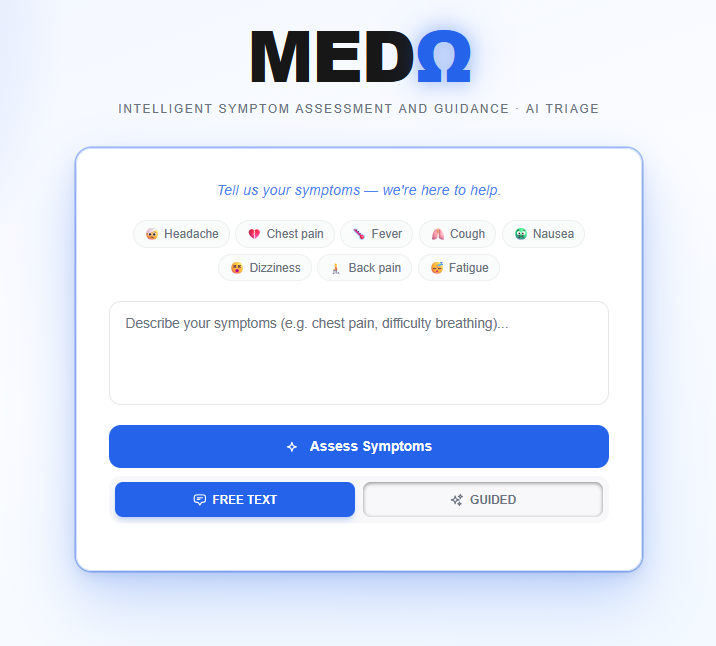
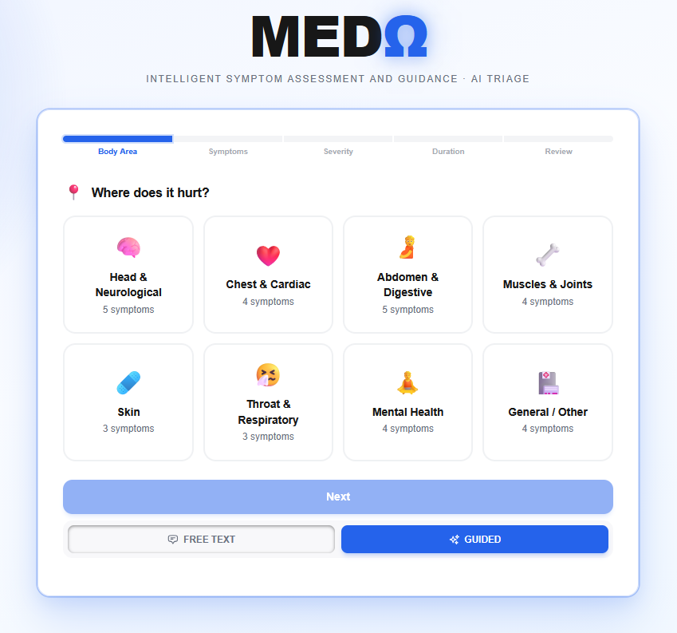
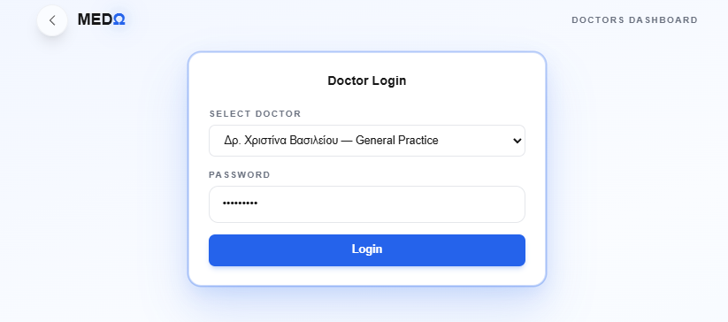
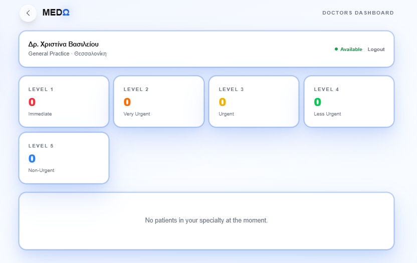
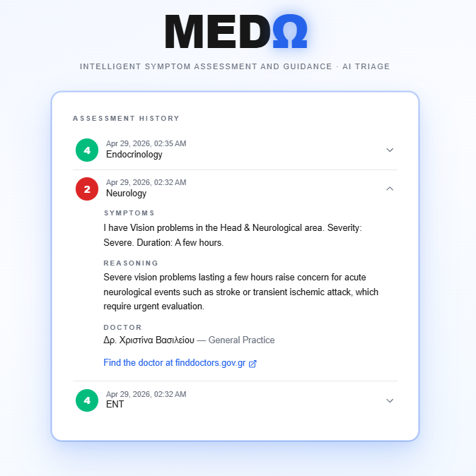
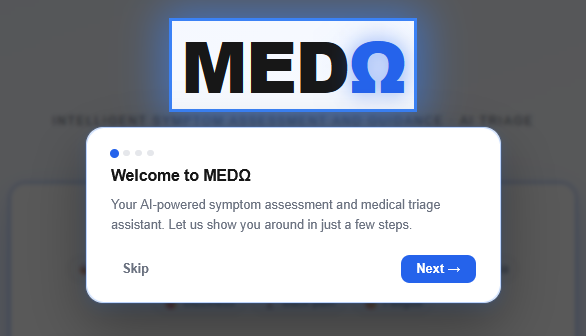
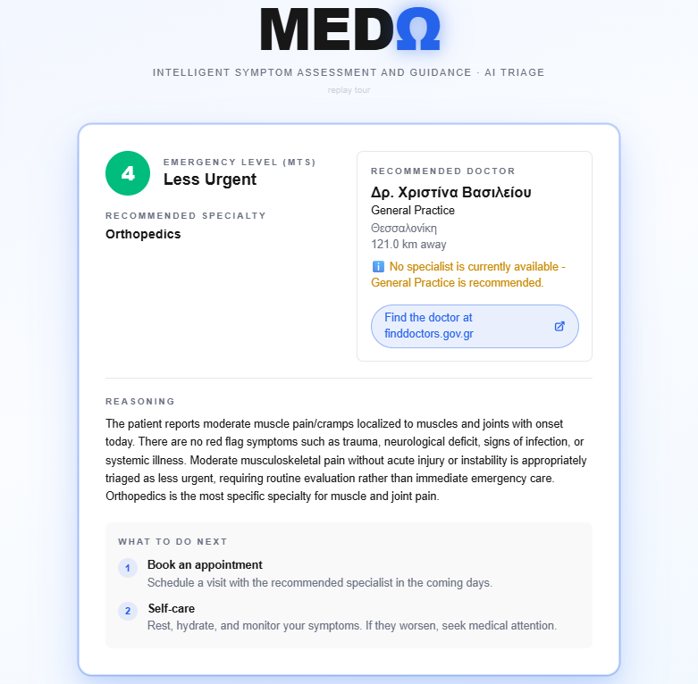
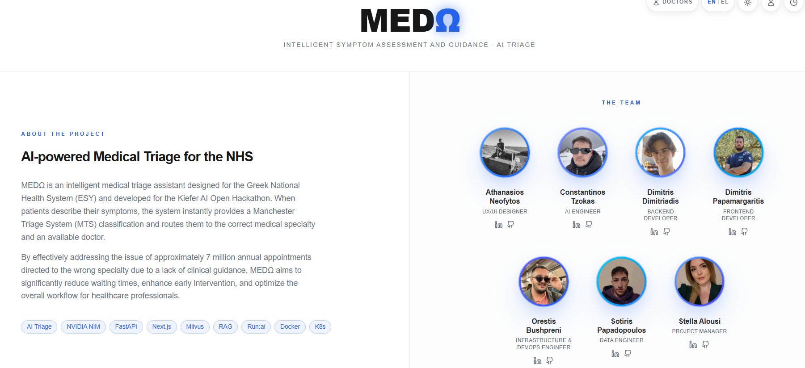
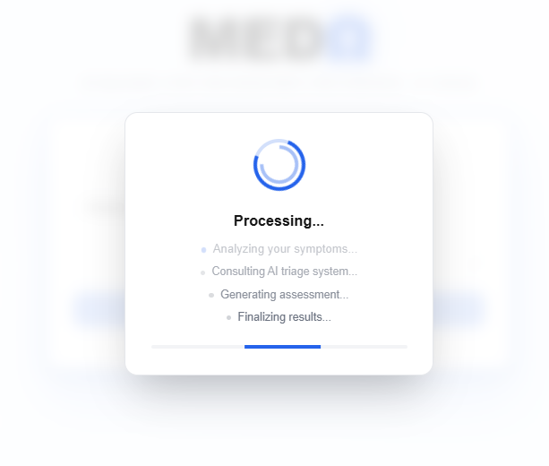
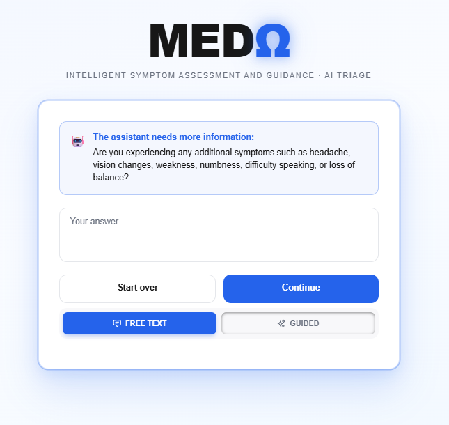

<div align="center">

<picture>
  <source media="(prefers-color-scheme: dark)" srcset="https://img.shields.io/badge/MED%CE%A9-AI%20Triage-2563eb?style=for-the-badge&logo=data:image/svg+xml;base64,PHN2ZyB3aWR0aD0iMjQiIGhlaWdodD0iMjQiIHZpZXdCb3g9IjAgMCAyNCAyNCIgZmlsbD0ibm9uZSIgeG1sbnM9Imh0dHA6Ly93d3cudzMub3JnLzIwMDAvc3ZnIj48cGF0aCBkPSJNMTIgMThhNiA2IDAgMSAwIDAtMTIgNiA2IDAgMCAwIDAgMTJaIiBmaWxsPSJ3aGl0ZSIvPjxwYXRoIGQ9Ik0xMiA0djE2TTQgMTJoMTYiIHN0cm9rZT0id2hpdGUiIHN0cm9rZS13aWR0aD0iMiIvPjwvc3ZnPg==">
  
</picture>

### AI-Powered Medical Triage for the Greek National Health System

<p>
  <a href="https://github.com/Contzokas/MedW/actions/workflows/deploy.yml">
    
  </a>
  <a href="LICENSE">
    
  </a>
  
  
  
  
</p>

<p>
  
  
  
  
</p>

> **Kiefer AI Open Hackathon 2026** — Built in 24 hours. Deployed on NVIDIA B200 GPUs via Run:ai.  
> Solving Greece's ~7 million annual misdirected appointments.

</div>

---

## Table of Contents

- [The Problem](#the-problem)
- [What MEDΩ Does](#what-med-does)
- [Feature Highlights](#feature-highlights)
- [Architecture](#architecture)
  - [AI Pipeline](#ai-pipeline--two-deployments-one-codebase)
  - [Triage Pipeline Flow](#triage-pipeline-flow)
  - [4-Tier Fallback Chain](#4-tier-fallback-chain)
- [Infrastructure & CI/CD](#infrastructure--cicd)
- [Quick Start](#quick-start)
- [API Reference](#api-reference)
- [Testing & Benchmarking](#testing--benchmarking)
- [Team](#team)
- [License](#license)

---

## The Problem

> [!IMPORTANT]
> Every year, **~7 million outpatient appointments** in the Greek NHS (ΕΣΥ) are directed to the wrong medical specialty — because patients self-refer without clinical guidance.

This clogs emergency departments, inflates wait times, and delays critical care for patients who actually need it.

**MEDΩ** replaces the guesswork with AI triage. Patients describe symptoms in natural Greek and receive an instant, clinically-informed urgency classification — before they ever leave home.

---

## What MEDΩ Does

<p align="center">
  
  &nbsp;
  
</p>

| Step | What Happens |
|:----:|-------------|
| **1** | Patient describes symptoms in **Greek or English** via a clean, accessible web interface |
| **2** | AI pipeline classifies urgency using the **Manchester Triage System (MTS 1–5)**, augmented with RAG retrieval from clinical guidelines |
| **3** | **Doctor is instantly matched** — right specialty, availability-checked, with a direct link to `finddoctors.gov.gr` |
| **4** | **Nurses see it live** via a real-time SSE dashboard — no polling, no refresh |

<p align="center">
  
  &nbsp;
  
</p>

---

## Feature Highlights

<p align="center">
  
  &nbsp;
  
  &nbsp;
  
</p>

| Feature | Description |
|---------|-------------|
| 🧭 **Symptom Wizard** | Guided step-by-step mode — body area → symptoms → severity → duration — for patients who need help articulating symptoms |
| 🔄 **Follow-Up Questions** | Confidence-gated loop: when symptoms are vague, the LLM asks clarifying questions before committing to a triage decision |
| 👤 **Patient Profiler** | Optional medical history (age, conditions, medications, allergies) stored only in the browser and injected into the LLM prompt |
| 📍 **Geolocation** | Finds the nearest available doctor by real distance (Haversine formula) |
| ⚠️ **Uncertain Result Fallback** | When the AI cannot reliably classify, it honestly admits uncertainty — no false confidence |
| 🌐 **Bilingual Everything** | Full Greek & English UI with proper Greek casing, translations, and locale-aware formatting |

---

## Architecture

<p align="center">
  
</p>

### AI Pipeline — Two Deployments, One Codebase

<table>
<tr>
<td width="50%" valign="top">

#### 🖥️ Local Dev (Docker Compose)

```
Patient → Next.js 16 → FastAPI
                           │
                    ┌──────┴──────┐
                    ▼             ▼
              Ollama          ChromaDB
           (medgemma:27b)   (RAG retrieval)
```

- On-premise, no internet needed
- CPU fallback: ~60–120s per request
- `docker compose up --build`

</td>
<td width="50%" valign="top">

#### ☁️ Production (Run:ai + K8s)

```
Patient → Next.js 16 → FastAPI
                           │
           ┌───────────────┼───────────────┐
           ▼               ▼               ▼
       NIM LLM         NIM Embed       Reranker
   (Nemotron 120B)  (nv-embedqa)   (cross-encoder)
   GPU 1+2 (2×B200)  GPU 3 (B200)      CPU
                           │
                           ▼
                      Milvus Lite
```

- NVIDIA NIM microservices
- 3× B200 GPUs via Run:ai scheduler
- GHCR → CI/CD auto-deploy

</td>
</tr>
</table>

### Stack Deep-Dive

| Layer | Technology | Why |
|-------|-----------|-----|
| **LLM** | NVIDIA Nemotron-3-Super 120B *(prod)* · medgemma:27b *(local)* | 120B params, tensor-parallel across 2× B200; medgemma for CPU-friendly local dev |
| **Embeddings** | nv-embedqa-e5-v5 (NIM) · all-MiniLM-L6-v2 (local) | 512-token context; encodes Greek symptoms after translation |
| **Vector DB** | Milvus Lite *(prod)* · ChromaDB 1.5.7 *(local)* | Embedded in the backend process — no separate service needed |
| **Reranker** | NVIDIA nv-rerankqa cross-encoder | Reranks top-9 retrieved chunks → top-3 most relevant before prompt assembly |
| **Backend** | Python 3.11 · FastAPI · LangChain 1.2 | Async SSE streaming, Pydantic validation, multi-level fallback chain |
| **Frontend** | Next.js 16 · React 19 · TypeScript 5 · Tailwind v4 | App Router, Turbopack, client-side contexts, CSS animations |
| **Infrastructure** | Docker Compose · GitHub Actions · Run:ai REST API · GHCR | CI/CD from push to live in <15 min; GPU scheduling via Run:ai |

### Triage Pipeline Flow

```
POST /api/v1/triage { symptoms, lang, patient_profile?, lat?, lon? }
         │
         ├─[1]─► Symptom keyword pre-filter
         │         Too vague? → RedirectToWizardResponse
         │
         ├─[2]─► RAG retrieval  (Milvus/ChromaDB → top-9 → rerank → top-3)
         │         Fail? → proceed with LLM base knowledge  (rag_used=false)
         │
         ├─[3]─► LLM classification  (Nemotron 120B or medgemma:27b)
         │         Greek → translate → classify → translate back
         │         Fail? → safe default  (MTS 3, General Practice)
         │
         ├─[4]─► Doctor matching  (specialty → availability → geolocation sort)
         │         No specialist available? → GP fallback with note
         │
         ├─[5]─► Confidence check
         │         Uncertain + under max rounds? → FollowUpResponse
         │         Uncertain + max rounds?       → UncertainResultResponse
         │
         └─[6]─► Push to SSE queue → nurses see it instantly
```

### 4-Tier Fallback Chain

| Tier | Trigger | Response |
|:----:|---------|----------|
| **1** | Normal operation | Full AI triage — RAG + LLM + doctor match |
| **2** | RAG unavailable | LLM classification with base knowledge only (`rag_used: false`) |
| **3** | LLM parse error | Safe default: MTS 3 "Urgent", General Practice, with explanatory note |
| **4** | Total failure | GP fallback — always returns a usable result, never an error page |

---

## Infrastructure & CI/CD

<p align="center">
  
  &nbsp;
  
</p>

### GitHub Actions Pipeline

```
git push → [main|dev] → .github/workflows/deploy.yml
                              │
                    ┌─────────┼─────────┐
                    ▼         ▼         ▼
              build-      build-    build-
              reranker    backend   frontend
                    │         │         │
                    └─────────┼─────────┘
                              ▼
                         push to GHCR
                    (ghcr.io/contzokas/*)
                              │
                              ▼
                        deploy (Run:ai)
                              │
                    ┌─────────┼─────────┐
                    ▼         ▼         ▼
              medw-nim   medw-backend  medw-frontend
             (GPU 1+2)     (CPU)          (CPU)
              medw-nim-embed  medw-nim-reranker
                (GPU 3)           (CPU)
```

### Cluster Architecture — Run:ai · NVIDIA B200

| Workload | GPU | CPU | Memory | Image |
|----------|:---:|:---:|:------:|-------|
| **NIM LLM** `medw-nim` | 2× B200 | 24 cores | 96 GB | `nvcr.io/nim/nvidia/nemotron-3-super-120b-a12b` |
| **NIM Embed** `medw-nim-embed` | 1× B200 | 4 cores | 8 GB | `nvcr.io/nim/nvidia/nv-embedqa-e5-v5` |
| **Reranker** `medw-nim-reranker` | — | 2 cores | 2 GB | `ghcr.io/contzokas/medw-reranker` |
| **Backend** `medw-backend` | — | 1 core | 1 GB | `ghcr.io/contzokas/medw-backend` |
| **Frontend** `medw-frontend` | — | 1 core | 512 MB | `ghcr.io/contzokas/medw-frontend` |

- **Total GPU footprint:** 3× NVIDIA B200 (Blackwell, 192 GB HBM3e each)
- **Deploy time:** ~15 minutes from push to live (includes model warmup)
- **Environment separation:** `main` → production · `dev` → development (isolated workloads)
- **Immutable tags:** Every deploy gets a sha-pinned tag (`latest-abc1234`) for easy rollback

---

## Quick Start

### Local — Docker Compose (medgemma:27b)

```bash
git clone https://github.com/Contzokas/MedW && cd MedW
cp .env.example .env
docker compose up --build
```

> [!NOTE]
> First run pulls the medgemma:27b model (~10 min). Subsequent starts are instant.

| Service | URL |
|---------|-----|
| Patient Triage | http://localhost:3000 |
| Nurse Dashboard | http://localhost:3000/dashboard |
| Management | http://localhost:3000/management |
| Doctors | http://localhost:3000/doctors |
| API Docs (Swagger) | http://localhost:8000/docs |

### Production Prerequisites

- NVIDIA GPU with CUDA 12.8+ (B200 requires `nvidia-container-toolkit`)
- Docker + Docker Compose v24+
- Run:ai cluster access (for K8s deployment)

---

## API Reference

| Method | Endpoint | Description |
|:------:|----------|-------------|
| `POST` | `/api/v1/triage` | Submit symptoms → MTS classification + doctor match |
| `GET` | `/api/v1/doctors` | List doctors (optional `?specialty=` filter) |
| `GET` | `/api/v1/triage/queue` | SSE stream — real-time nurse dashboard |
| `GET` | `/api/v1/triage/history/{patient_id}` | Patient triage history |
| `GET` | `/api/v1/health` | Liveness probe |
| `GET` | `/api/v1/health/warmup` | LLM warmup status + readiness |
| `GET` | `/api/v1/rag/debug/*` | RAG pipeline introspection *(dev only, gated behind `RAG_DEBUG_ENABLED`)* |

<details>
<summary><strong>Example Request & Response</strong></summary>

**Request**

```json
POST /api/v1/triage
{
  "symptoms": "Έχω έντονο πόνο στο στήθος και δυσκολεύομαι να αναπνεύσω",
  "patient_id": "patient-001",
  "lang": "el",
  "patient_profile": "Age: 34\nBiological sex: Male\nChronic conditions: Asthma",
  "latitude": 37.9838,
  "longitude": 23.7275
}
```

**Response — MTS Level 1 (Emergency)**

```json
{
  "mts_level": 1,
  "mts_label": "Άμεση Αντιμετώπιση",
  "specialty": "Καρδιολογία",
  "doctor": {
    "name": "Δρ. Ελένη Παπαδοπούλου",
    "specialty": "Καρδιολογία",
    "availability": true,
    "distance_km": "1.2"
  },
  "reasoning": "Severe chest pain with respiratory distress indicates a potential cardiac emergency...",
  "redirect_url": "https://finddoctors.gov.gr/search?specialty=Καρδιολογία",
  "rag_used": true
}
```

</details>

---

## Testing & Benchmarking

```bash
# Unit tests
cd backend && pip install -r requirements.txt && pytest

# With coverage report
pytest --cov=app --cov-report=term-missing

# Latency benchmark (11 test cases × N runs)
python scripts/benchmark_latency.py --url http://localhost:8000 --runs 5 --csv results.csv

# Accuracy evaluation (against labeled ground truth)
python test_triage_baseline.py
```

---

## Team

Built with ☕ and γύρος by:

| Member | Role |
|--------|------|
| **Athanasios Neofytos** | AI Engineer |
| **Constantinos Tzokas** | Infrastructure & DevOps |
| **Dimitris Dimitriadis** | Backend Developer |
| **Dimitris Papamargaritis** | Data Engineer |
| **Orestis Bushpreni** | Frontend Developer |
| **Sotiris Papadopoulos** | Data Scientist |
| **Stella Alousi** | UX/UI Designer & Project Manager |

---

## License

Apache 2.0 — see [LICENSE](LICENSE)

---

<div align="center">
  <sub>Built for the <strong>Kiefer AI Open Hackathon 2026</strong> · Athens, Greece 🇬🇷</sub>
</div>
